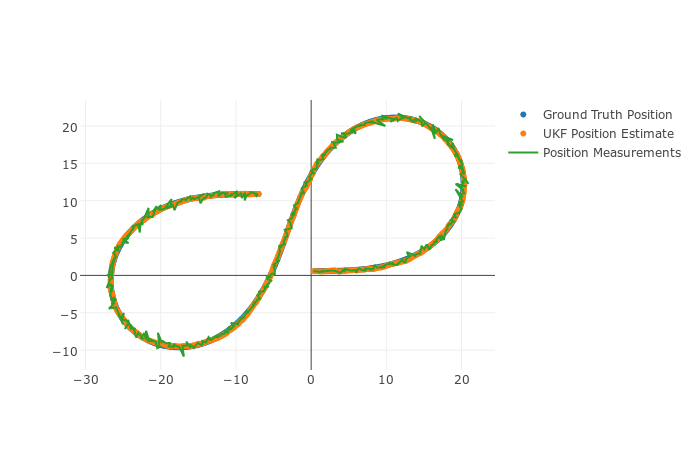
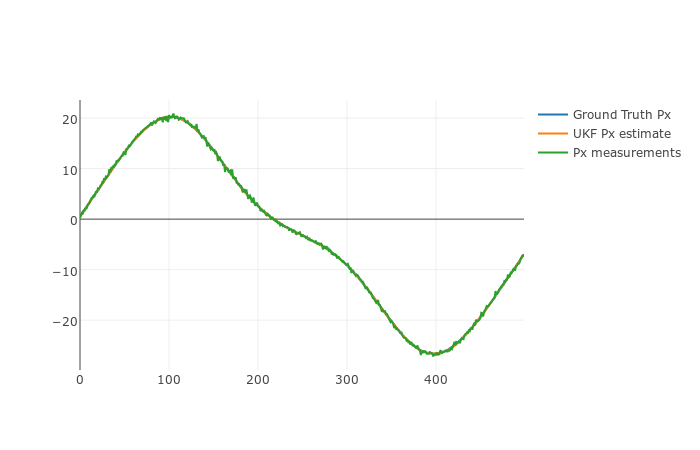
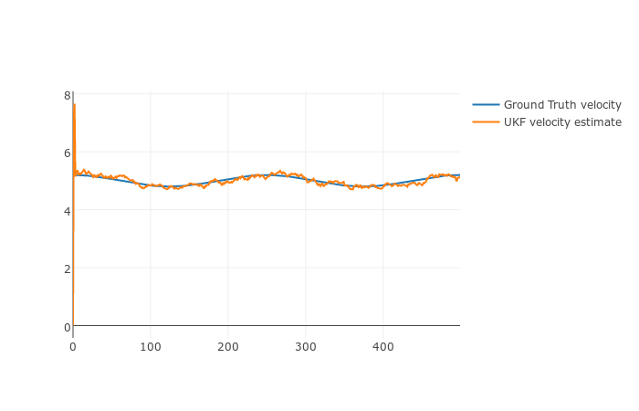
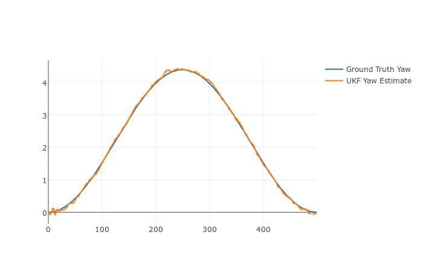
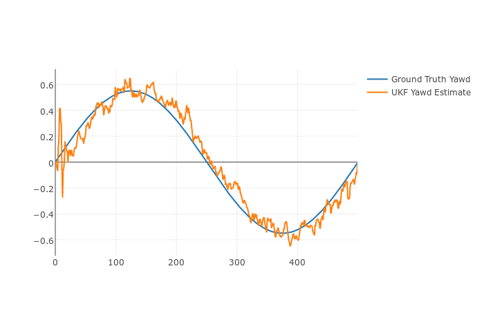
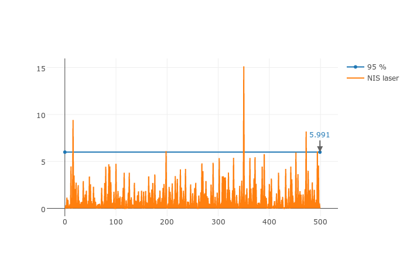
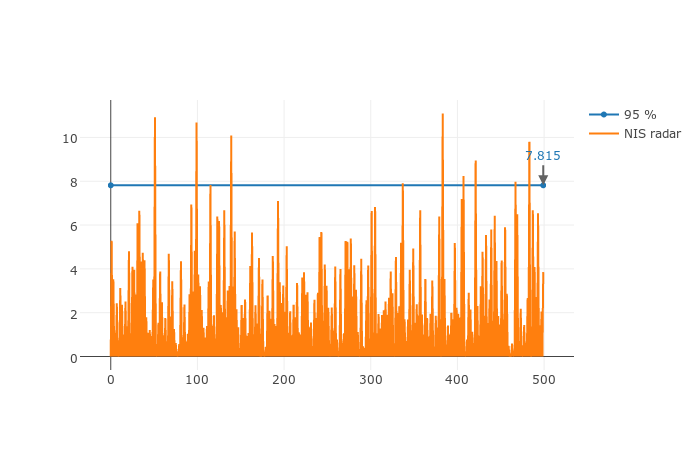

# Unscented Kalman Filter Project Starter Code
Self-Driving Car Engineer Nanodegree Program

---

## Dependencies

* cmake >= v3.5
* make >= v4.1
* gcc/g++ >= v5.4

## Structure

  - `data`: folder containing sensor data files
  - `scr`: a directory with the project code
  - `main.cpp`: reads sensor data, calls the Kalman filter for each measurement read, and calls a function to calculate the RMSE.
  - `ukf.cpp`:  implementation of the Unscented Kalman Filter.
  - `tools.cpp`: implements a function to calculate RMSE.
  - `Visualization.ipynb`: a python notebook for generating graphs from the output of the UKF.

## Basic Build Instructions

1. Clone this repo.
2. Make a build directory: `mkdir build && cd build`
3. Compile: `cmake .. && make`
4. Run it: `./UnscentedKF path/to/input.txt path/to/output.txt`. You can find
   some sample inputs in 'data/'.
    - eg. `./UnscentedKF ../data/obj_pose-laser-radar-synthetic-input.txt`

## Description
The goal of this project is to implement an Unscented Kalman filter using the CTRV motion model. This UKF will fuse data from Radar and Lidar sensors to track a bicycle.

The Unscented Kalman Filter allows us to allow you to use non-linear equations for the process and measurement models. After the initialization, for each received measurement, the UKF performs two main steps: Prediction and Update.

In the Prediction step, it generates sigma points from the current (a posteriori) state (mean and covariance), augments them with the process noise, and applies to process model function to them to predict the (a priori) mean state vector and process covariance matrices.

In the Update step, the predicted sigma points are transformed into the measurement space, and then the (a posteriori) state is updated based on sensor (Radar or Lidar) measurements.

Figures below show how the UKF tracks the state of a bicycle
based on a simulation data set.

## Results

Position:

Position (Px):

Velocity:

Yaw:

Yaw Rate:

#### MSE

The Unscented Kalman Filter, with the provided sensor data set produces the Root-Median-Squared Error (RMSE) values below:

| Input |  RMSE   |
| ----- | ------- |
|  px   | 0.06325 |
|  py   | 0.08171 |
|  vx   | 0.30940 |
|  vy   | 0.15945 |

The table below compares the the UKF with sensor fusion,
to the UKF with one sensor enabled at a time. It also
compares the UKF to an Extended Kalman Filter.

| Input | UKF-Radar | UKF-Lidar | EKF-Fusion | UKF-Fusion |
| ----- | --------- | --------- | ---------- | ---------- |
|  px   |  0.14337  |  0.09010  |  0.09722   |  0.06325   |
|  py   |  0.19638  |  0.09606  |  0.08537   |  0.08171   |
|  vx   |  0.32648  |  0.40516  |  0.45085   |  0.30940   |
|  vy   |  0.20437  |  0.21577  |  0.43958   |  0.15945   |

As expected, the UKF, which uses a non-linear process model in addition to the non-linear measurement model, produces better results that the EKF, which handles non-linear functions differently.

It is also clear that the fusion of sensors produces better results than the sensors taken separately.

#### NIS

The UKF produces the following Normalized Innovation Squared (NIS) for each sensor. This represents the normalized difference between the measurement and its expected value. It follows a Chi-squared distribution (with 2 d.f for Lidar and 3 d.f. for radar). The blue line represents the NIS values below of which the probability of seeing them is 95%. It is an indicator of the consistency of the Kalman Filter.

NIS Lidar

NIS Radar

